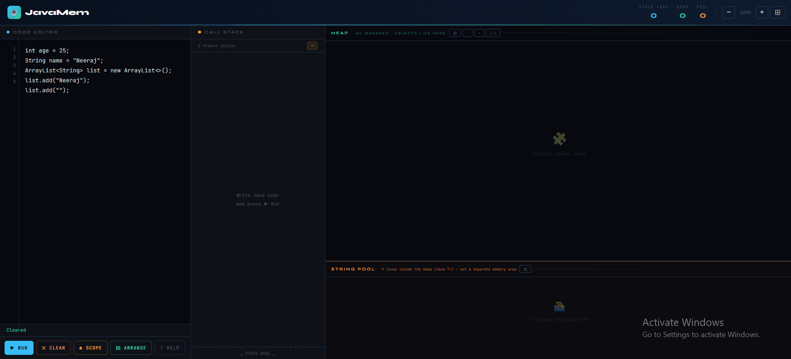

# 🧠 JavaMem – Java Memory Visualizer



> **Most Java memory tools show you a diagram. JavaMem shows you what's actually happening — and corrects the mental models that textbooks get wrong.**

JavaMem is a live, browser-based tool that visualizes how Java manages memory — stack, heap, string pool — in real time. Type simplified Java code into the editor, press Run, and watch an animated interactive diagram appear showing exactly where every variable lives, how references point to objects, how data structures are laid out, and what happens when objects go out of scope.

Built as a single self-contained HTML file. No install, no build step, no backend.

---

## 🎯 Why I Built This

While learning and teaching Java, I noticed that most memory visualizers — and even most textbooks — quietly teach wrong mental models. Things like:

- **HashMap showing entries in insertion order** — making students think order is guaranteed (it isn't)
- **ArrayList and LinkedList looking identical** — hiding the fundamental difference between contiguous array cells and scattered node objects
- **Stack showing items bottom-up** — the opposite of how a real LIFO stack works
- **LinkedList appearing as one heap object** — when in reality each node is a separate scattered allocation
- **GC appearing instant** — when objects become eligible and when they're actually collected are two different events
- **String Pool shown as a separate memory area** — when since Java 7 it lives inside the heap
- **Integer cache only noted for explicit `Integer` types** — missing the autoboxing trap that causes `==` to silently fail above 127
- **One flat stack frame** — giving no sense that each method call gets its own isolated frame

I identified these 8 specific problems and built JavaMem to correct each one visually — not with a note in the corner, but in how each structure is actually rendered.

---

## 🚀 Live Demo

Open `index.html` directly in any modern browser on a laptop or tablet. That's it.

> ⚠️ Optimized for larger screens (laptop/tablet). A mobile warning is shown on small viewports.

---

## 🖥️ UI Layout

```
┌──────────────────────────────────────────────────────────────────┐
│  Header: JavaMem logo · Stack / Heap / Pool counts · Zoom        │
├───────────────┬──────────────┬───────────────────────────────────┤
│               │              │                                   │
│  Code Editor  │  Call Stack  │         Heap Region               │
│               │  (frames +   │   (draggable object cards)        │
│  [▶ Run]      │   variable   ├───────────────────────────────────┤
│  [Clear]      │   cards)     │  String Pool  ← lives inside Heap │
│  [⏏ Scope]   │              │  (interned strings, int cache)    │
│  [⊞ Arrange]  │              │                                   │
│  [? Help]     │              │                                   │
└───────────────┴──────────────┴───────────────────────────────────┘
```

Animated SVG arrows float over the entire layout, connecting each stack reference variable to its corresponding heap object, color-coded by type.

---

## 📦 Supported Java Types & Data Structures

---

### Primitive Types — Stack Only

Primitive values are stored directly on the stack card. No heap object is created.

| Type | Example |
|---|---|
| `int` | `int age = 25;` |
| `double` | `double gpa = 9.2;` |
| `float` | `float pi = 3.14;` |
| `long` | `long big = 100L;` |
| `boolean` | `boolean flag = true;` |
| `char` | `char c = 'A';` |
| `byte` | `byte b = 8;` |
| `short` | `short s = 32;` |

---

### String — String Pool (inside the Heap)

`String` literals go to the **String Pool**, which lives inside the Heap region (Java 7+). Two variables with identical string values point to the same pool object — simulating Java's string interning.

```java
String name  = "Neeraj";
String name2 = "Neeraj"; // → same pool object, two references
String s     = new String("Alice"); // → new heap object, not pooled
```

---

### Integer — Wrapper & Cache

Integers in **−128 to 127** are served from the Integer cache — the same object is reused. Outside that range, a new heap object is created every time. JavaMem makes this visible with a warning on out-of-cache objects explaining why `==` is unreliable for `Integer`.

```java
Integer a = 100; // cache hit — shared object
Integer b = 200; // new heap object — a == b would be false here
```

---

### ArrayList — Contiguous Indexed Cells

Rendered as **horizontal indexed cells** `[0] · [1] · [2]` — visually reflecting that ArrayList is backed by a contiguous array, not a linked structure. O(1) index access, O(n) insert/delete.

```java
ArrayList<String> list = new ArrayList<>();
list.add(Alice);
list.add(Bob);
```

| Operation | Behavior |
|---|---|
| `add` | Appends value, new cell appears |
| `remove last` | Removes last cell |

---

### LinkedList — Separate Node Objects in the Heap

Each node is spawned as its own **individual heap card**, scattered across the heap canvas — showing that LinkedList nodes are separate allocations connected by pointers, not a single block. Each node card shows its `value` field and `next →` pointer.

```java
LinkedList<Integer> ll = new LinkedList<>();
ll.add(10);
ll.add(20);
ll.add(30);
```

The controller card shows a compact chain `[10] → [20] → [30] → ∅` while individual node cards live separately in the heap.

| Operation | Behavior |
|---|---|
| `add (tail)` | Appends and spawns a new node card in the heap |
| `remove (val)` | Removes matching node; blank input removes tail |

---

### Stack — LIFO Tower

Rendered as a **vertical tower with the top at the top**. New items push upward, `pop()` removes from the top. The `← TOP` label always marks the active element.

```java
Stack<String> stk = new Stack<>();
stk.push(First);
stk.push(Second);
stk.push(Top);
```

| Operation | Behavior |
|---|---|
| `push ↑` | New item appears at top of tower |
| `pop ↓` | Removes and displays the top item |

---

### HashMap / TreeMap / LinkedHashMap

Each map type is rendered differently to show how order actually works:

- **HashMap** — entries displayed in hash bucket order with `[b0]`, `[b3]`, `[b11]`... bucket indices and a warning: *order NOT guaranteed*
- **TreeMap** — entries sorted by key, labeled *sorted (natural order)*
- **LinkedHashMap** — entries in insertion order, labeled *insertion-order preserved*

```java
HashMap<String, String> map = new HashMap<>();
map.put(name, Neeraj);
map.put(city, Delhi);
```

| Operation | Behavior |
|---|---|
| `put` | Inserts or updates entry |
| `remove` | Deletes entry by key |

---

### HashSet / TreeSet

- **HashSet** — elements shown in hash order as chips, with warning: *iteration order NOT guaranteed*
- **TreeSet** — elements shown sorted

```java
HashSet<String> set = new HashSet<>();
set.add(apple);
```

| Operation | Behavior |
|---|---|
| `add` | Adds if not already present |
| `remove` | Removes specified value |

---

### BST — Binary Search Tree

Rendered as a **canvas-drawn tree** — nodes as yellow-bordered circles, edges as lines, root labeled. Canvas resizes with tree depth. In-order traversal shown as a sorted sequence. Full BST deletion logic including in-order successor replacement.

```java
BST tree = new BST();
tree.add(50);
tree.add(30);
tree.add(70);
```

| Operation | Behavior |
|---|---|
| `insert` | Inserts numeric value following BST rules |
| `delete` | Deletes node; handles all cases |

---

### Arrays

Fixed-size arrays rendered as indexed cells (same style as ArrayList), labeled *fixed-size contiguous block*.

```java
int[] nums = new int[5];
int[] scores = {95, 87, 76};
```

| Operation | Behavior |
|---|---|
| `set[i]` | Sets value at given index |
| `reset` | Resets index to `0` |

---

## 🧰 Editor Controls

| Button | Action |
|---|---|
| **▶ Run** (`Ctrl+Enter`) | Parses editor code and renders the memory diagram |
| **✕ Clear** | Clears all variables, heap objects, resets diagram |
| **⏏ Scope** | Select stack variables to pop; orphaned objects become GC-eligible |
| **⊞ Arrange** | Auto-arranges heap cards in a grid |
| **? Help** | Opens syntax reference |

---

## ⚡ Memory Mechanics Simulated

**String interning** — identical string literals share one pool object; reference count tracked and displayed.

**Integer cache** — boxed integers −128 to 127 reuse cached objects. Out-of-range integers get a warning explaining why `==` fails.

**Two-phase garbage collection** — when scope pop removes the last reference to an object, it enters a *GC-eligible* state (red pulsing border, `⚠ GC eligible — unreachable` badge). After a random 1.5–4 second delay it is actually collected with a fade animation. This reflects that GC eligibility and GC collection are two separate events.

**Call stack frames** — variables are grouped into named stack frames. The active frame is highlighted. Popping scope removes variables from the active frame.

**Reference arrows** — animated dashed bezier curves connect each reference variable to its heap object, color-coded by type (blue for general refs, teal for LinkedList, yellow for BST, orange for pool).

**Zoom & drag** — heap object cards are freely draggable; each memory region can be zoomed independently.

---

## 📝 Supported Syntax

```java
// Primitives
int x = 10;
double d = 3.14;
boolean flag = true;
char c = 'A';

// Strings
String name = "Alice";
String s = new String("Alice"); // forces new heap object

// ArrayList
ArrayList<String> list = new ArrayList<>();
list.add(Alice);

// LinkedList
LinkedList<Integer> ll = new LinkedList<>();
ll.add(10);
ll.add(20);
ll.remove(10);

// Stack
Stack<Integer> stk = new Stack<>();
stk.push(1);
stk.push(2);
stk.pop();

// HashMap / TreeMap / LinkedHashMap
HashMap<String, String> map = new HashMap<>();
map.put(key, value);
map.remove(key);

// HashSet / TreeSet
HashSet<String> set = new HashSet<>();
set.add(hello);
set.remove(hello);

// BST
BST tree = new BST();
tree.add(50);
tree.add(30);
tree.remove(30);

// Arrays
int[] nums = new int[5];
int[] scores = {95, 87, 76};
```

> String and identifier values in method calls do not need quotes in the editor syntax.

---

## 🔍 Memory Regions

| Region | Color | What Lives Here |
|---|---|---|
| **Stack** | Blue | All declared variables — primitives as values, references as addresses |
| **Heap** | Green | All non-pooled reference objects |
| **String Pool** | Orange | Interned strings and Integer cache entries — a sub-region inside the Heap |

---


---

⭐ Have ideas or want to contribute? Open an issue or start a discussion.
